# Lab - Nextflow Cardinality

Please open this `README.md` by right-clicking and using `Show Preview` or 
`Open Preview`.

## Concepts you'll need

Quick definitions for vocabulary used throughout this lab, in case any of it is new:

- **List**: a Groovy list is an ordered collection of values, written with square
  brackets, e.g. `['sample_a', 'sample_b', 'sample_c']`. Same idea as a Python list.
- **Channel**: a Nextflow object that holds a stream of values and feeds them to a
  process. Channels manage the flow of data between processes and enable asynchronous
  execution and parallelism. You will often need to make an initial channel that holds
  your starting information or files, otherwise, nextflow outputs always create a channel.
- **`channel.of(...)`**: builds a channel from the arguments you pass it. Each
  argument becomes its own emission, so `channel.of('a', 'b', 'c')` is a channel
  with 3 emissions. Passing a single list argument instead, like
  `channel.of(['a', 'b', 'c'])`, is different: the whole list becomes *one*
  emission (compare `case1.nf` and `case2.nf` below).
- **`record(...)`**: Nextflow's built-in syntax for a small, named-field object,
  e.g. `record(id: 'sample_a', fastq: 'sample_a.fastq.gz')`. Fields can be accessed
  by name

One of the most important concepts to understand in nextflow is cardinality
or how many separate values a channel emits. This single property will determine
whether a process runs once or multiple times: Nextflow will implicitly
parallelize a process across every element a channel emits, one process per 
emission. 

You may have noticed that you define the pipeline as it should run for a single
sample and nextflow will automatically handle parallelizing it for you. You call
processes *once* and nextflow determines how many tasks to generate based on
how many elements are in the channel. 

This behavior is critical when your workflows start to involve datasets with
tens to hundreds of samples and when certain processes will need to combine the
outputs from many other processes
. 
This behavior must also be considered when you are instead trying to group
many values into a single emission to be used together, rather than processed
in parallel. For a relevant bioinformatics example, we often want to parallelize
many of the initial sample processing steps, which can be done independently to each
respective sample, before aggregating all of the results together into a final output.

In this lab, we will explore how to determine how many values a channel emits, and
how to use standard Nextflow operators to manipulate and modify channel outputs to 
our desired shape and cardinality. 

## Reading `.view()` output

Before the exercises, you need a reliable way to tell how many things a channel is
emitting. The rule:

> **Count the lines `.view()` prints, not the brackets in them.**
> - N lines printed = N separate emissions -> a downstream process runs N times, once
>   per emission.
> - 1 line printed = 1 emission -> the process runs once, even if that single value is
>   itself a list.

Brackets alone are misleading: a single emission can itself be a record or list, and
that renders with brackets too. Pairing `.view()` with `.count().view()` rwill
tell you exactly how many elements are in the channel.

## Part 1: Predict how operators will transform channels

In `view_cases/`, you'll find eight small scripts, each building a channel with a
different operator (or combination of operators). The code comments are deliberately
minimal. For each case:

1. **Read the code first.** Do not run it yet.
2. **Predict** two things and fill them into [`ANSWERS.md`](ANSWERS.md): how many
   lines you expect the `.view()` call to print, and what a single emission will
   look like -- a bare value, a list, or a record.
3. **Run it**: `nextflow run view_cases/caseN.nf`, and count the lines it actually
   prints.
4. **Rewrite the code**: add one line to the script that calls `.count()` on the same
   channel referenced by `.view()`, and `.view()` that result too. This gives you an
   unambiguous number instead of counting lines by eye.
5. **Use the `Show diagram` button** to look at a visual representation of what it's
   doing.

> **Tip:** open [`ANSWERS.md`](ANSWERS.md) in a regular editor tab next to this
> file's preview -- that way you can read the diagrams here while typing your
> answers there, instead of fighting a read-only preview.

### view_cases/case1.nf

**To Do:** 

1. Read the code for `view_cases/case1.nf` and determine how many elements
will be in the channel created. 

2. Enter in your predictions into `ANSWERS.md`

3. Add in a line to use `.count()` and `.view()` and compare the answer you
get to the diagrams you see below, which are a visual representation of what 
the cardinality of each of these processes look like.


**Part 1 -- building the channel**

<details>
<summary>Show diagram</summary>

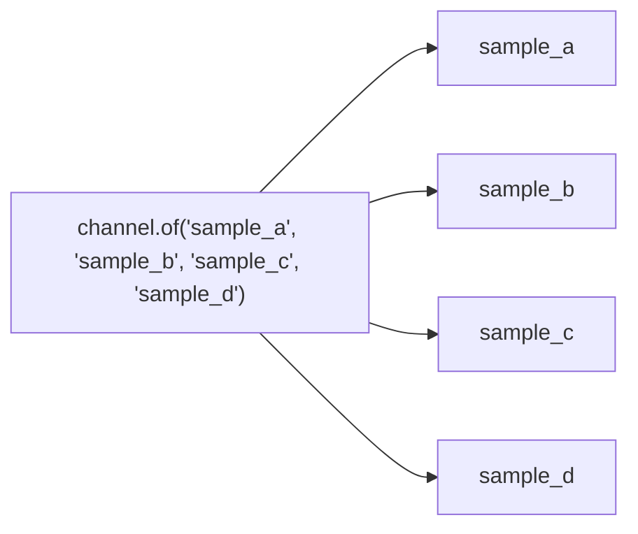
```mermaid
flowchart LR
    A["channel.of('sample_a', 'sample_b', 'sample_c', 'sample_d')"] --> B1["sample_a"]
    A --> B2["sample_b"]
    A --> B3["sample_c"]
    A --> B4["sample_d"]
```

</details>

**Part 2 -- `.view()`**

<details>
<summary>Show diagram</summary>

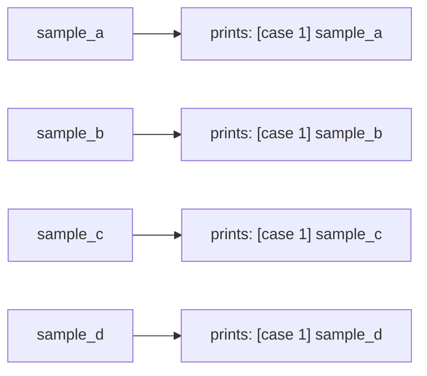
```mermaid
flowchart LR
    B1["sample_a"] --> V1["prints: [case 1] sample_a"]
    B2["sample_b"] --> V2["prints: [case 1] sample_b"]
    B3["sample_c"] --> V3["prints: [case 1] sample_c"]
    B4["sample_d"] --> V4["prints: [case 1] sample_d"]
```

</details>

**Part 3 -- `.count().view()`**

<details>
<summary>Show diagram</summary>

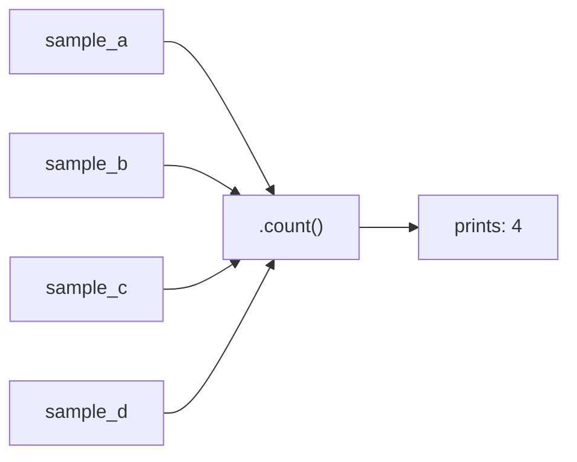
```mermaid
flowchart LR
    B1["sample_a"] & B2["sample_b"] & B3["sample_c"] & B4["sample_d"] --> C[".count()"] --> V5["prints: 4"]
```

</details>

### view_cases/case2.nf

**To Do:** 

1. Read the code for `view_cases/case2.nf` and determine how many elements
will be in the channel created. Notice this uses a single list argument to
`channel.of()`, unlike case 1's separate arguments. 

2. Enter in your predictions into `ANSWERS.md`

3. Add in a line to use `.count()` and `.view()` and compare the answer you
get to the diagrams you see below, which are a visual representation of what 
the cardinality of each of these processes look like.


**Part 1 -- building the channel (single list argument)**

<details>
<summary>Show diagram</summary>

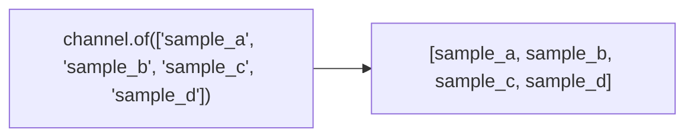
```mermaid
flowchart LR
    A["channel.of(['sample_a', 'sample_b', 'sample_c', 'sample_d'])"] --> B1["[sample_a, sample_b, sample_c, sample_d]"]
```

</details>

**Part 2 -- `.view()`**

<details>
<summary>Show diagram</summary>


```mermaid
flowchart LR
    B1["[sample_a, sample_b, sample_c, sample_d]"] --> V1["prints: [case 2] [sample_a, sample_b, sample_c, sample_d]"]
```

</details>

### view_cases/case3.nf

**To Do:** 

1. Read the code for `view_cases/case3.nf` and determine how many elements
will be in `ch_b` after `map()` transforms each element of `ch_a`. 

2. Enter in your predictions into `ANSWERS.md`

3. Add in a line to use `.count()` and `.view()` and compare the answer you
get to the diagrams you see below, which are a visual representation of what 
the cardinality of each of these processes look like.


**Part 1 -- building the channel**

<details>
<summary>Show diagram</summary>


```mermaid
flowchart LR
    A["channel.of('sample_a', 'sample_b', 'sample_c', 'sample_d')"] --> B1["sample_a"]
    A --> B2["sample_b"]
    A --> B3["sample_c"]
    A --> B4["sample_d"]
```

</details>

**Part 2 -- `.map()` to ch_b**

<details>
<summary>Show diagram</summary>

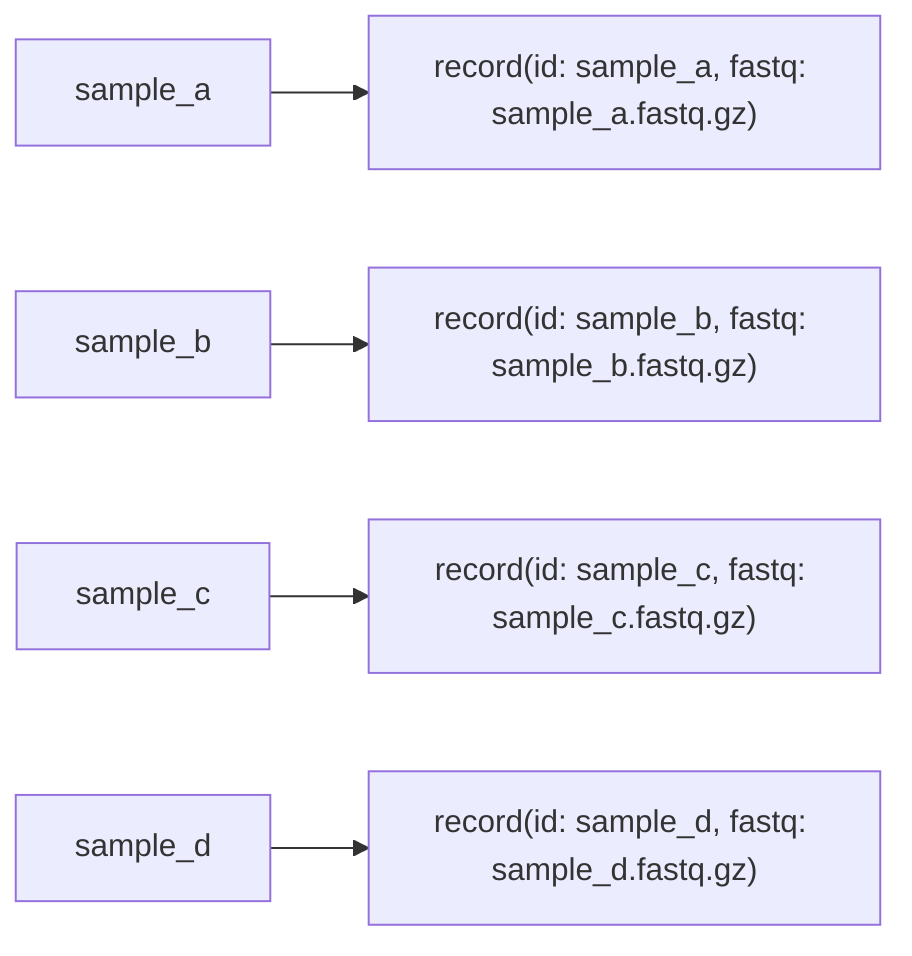
```mermaid
flowchart LR
    B1["sample_a"] --> M1["record(id: sample_a, fastq: sample_a.fastq.gz)"]
    B2["sample_b"] --> M2["record(id: sample_b, fastq: sample_b.fastq.gz)"]
    B3["sample_c"] --> M3["record(id: sample_c, fastq: sample_c.fastq.gz)"]
    B4["sample_d"] --> M4["record(id: sample_d, fastq: sample_d.fastq.gz)"]
```

</details>

**Part 3 -- `.view()`**

<details>
<summary>Show diagram</summary>

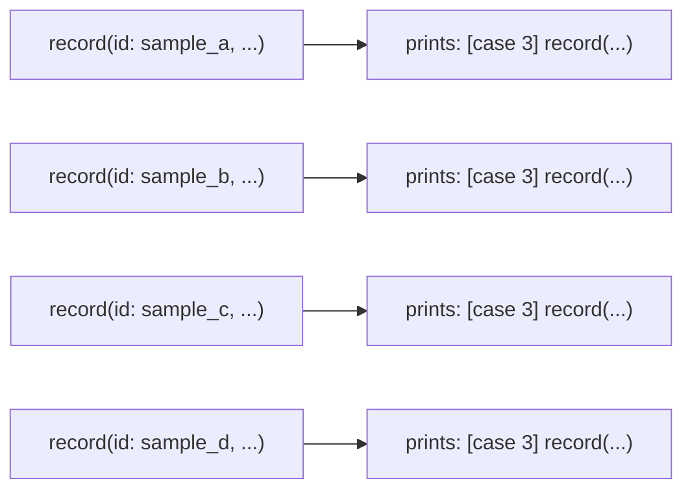
```mermaid
flowchart LR
    M1["record(id: sample_a, ...)"] --> V1["prints: [case 3] record(...)"]
    M2["record(id: sample_b, ...)"] --> V2["prints: [case 3] record(...)"]
    M3["record(id: sample_c, ...)"] --> V3["prints: [case 3] record(...)"]
    M4["record(id: sample_d, ...)"] --> V4["prints: [case 3] record(...)"]
```

</details>

### view_cases/case4.nf

**To Do:** 

1. Read the code for `view_cases/case4.nf` and determine how many elements
will be in `ch_b` after `flatMap()` is applied to each list. 

2. Enter in your predictions into `ANSWERS.md`

3. Add in a line to use `.count()` and `.view()` and compare the answer you
get to the diagrams you see below, which are a visual representation of what 
the cardinality of each of these processes look like.


**Part 1 -- building the channel (2 records, each carrying a list of reps)**

<details>
<summary>Show diagram</summary>

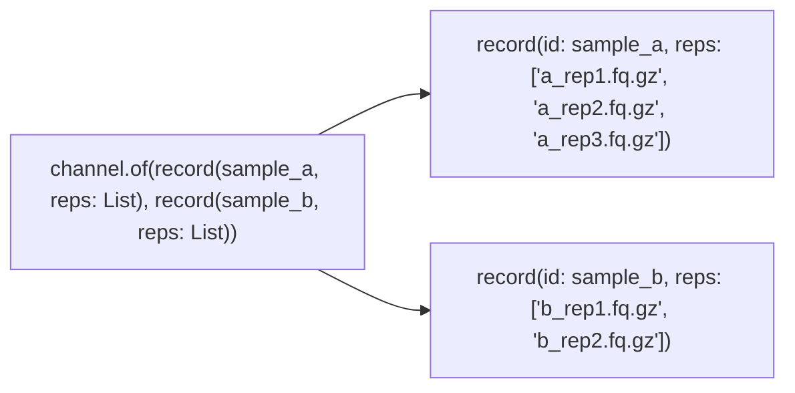
```mermaid
flowchart LR
    A["channel.of(record(sample_a, reps: List), record(sample_b, reps: List))"] --> B1["record(id: sample_a, reps: ['a_rep1.fq.gz', 'a_rep2.fq.gz', 'a_rep3.fq.gz'])"]
    A --> B2["record(id: sample_b, reps: ['b_rep1.fq.gz', 'b_rep2.fq.gz'])"]
```

</details>

**Part 2 -- `.flatMap()` unpacking reps to ch_b**

<details>
<summary>Show diagram</summary>

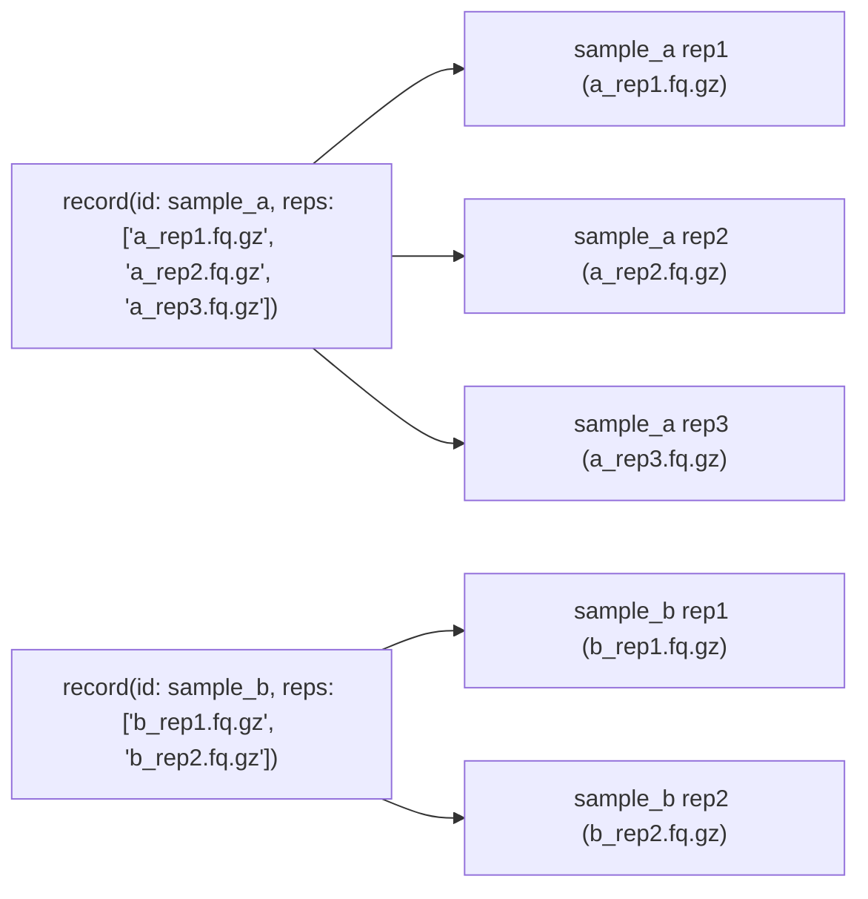
```mermaid
flowchart LR
    B1["record(id: sample_a, reps: ['a_rep1.fq.gz', 'a_rep2.fq.gz', 'a_rep3.fq.gz'])"] --> F1["sample_a rep1 (a_rep1.fq.gz)"]
    B1 --> F2["sample_a rep2 (a_rep2.fq.gz)"]
    B1 --> F3["sample_a rep3 (a_rep3.fq.gz)"]
    B2["record(id: sample_b, reps: ['b_rep1.fq.gz', 'b_rep2.fq.gz'])"] --> F4["sample_b rep1 (b_rep1.fq.gz)"]
    B2 --> F5["sample_b rep2 (b_rep2.fq.gz)"]
```

</details>

**Part 3 -- `.view()`**

<details>
<summary>Show diagram</summary>

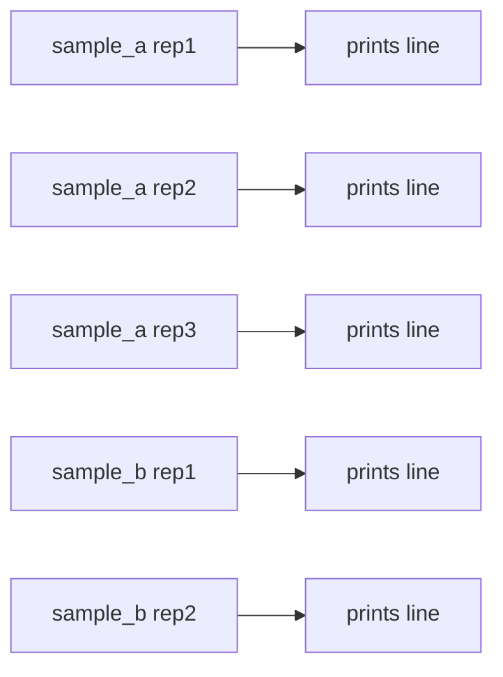
```mermaid
flowchart LR
    F1["sample_a rep1"] --> V1["prints line"]
    F2["sample_a rep2"] --> V2["prints line"]
    F3["sample_a rep3"] --> V3["prints line"]
    F4["sample_b rep1"] --> V4["prints line"]
    F5["sample_b rep2"] --> V5["prints line"]
```

</details>

### view_cases/case5.nf

**To Do:** 

1. Read the code for `view_cases/case5.nf` and determine how many elements
will be in `ch_b` after `collect()` is applied.

2. Enter in your predictions into `ANSWERS.md`

3. Add in a line to use `.count()` and `.view()` and compare the answer you
get to the diagrams you see below, which are a visual representation of what 
the cardinality of each of these processes look like.


**Part 1 -- building the channel**

<details>
<summary>Show diagram</summary>


```mermaid
flowchart LR
    A["channel.of('sample_a', 'sample_b', 'sample_c', 'sample_d')"] --> B1["sample_a"]
    A --> B2["sample_b"]
    A --> B3["sample_c"]
    A --> B4["sample_d"]
```

</details>

**Part 2 -- `.collect()` to ch_b**

<details>
<summary>Show diagram</summary>

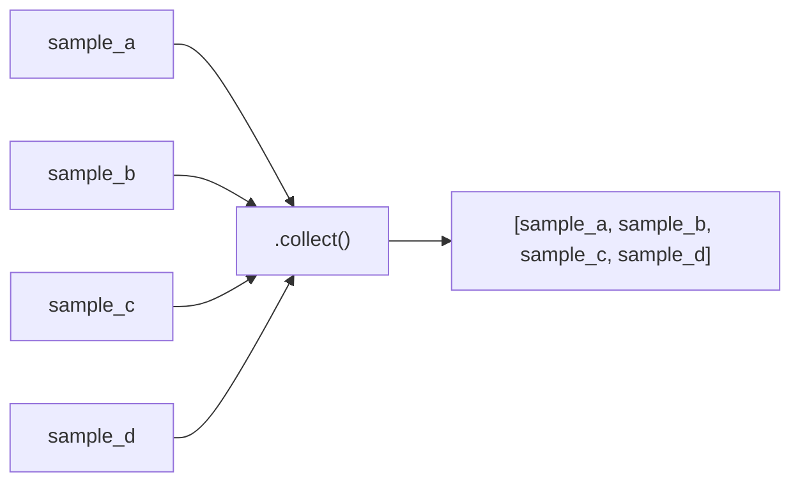
```mermaid
flowchart LR
    B1["sample_a"] & B2["sample_b"] & B3["sample_c"] & B4["sample_d"] --> L[".collect()"] --> B5["[sample_a, sample_b, sample_c, sample_d]"]
```

</details>

**Part 3 -- `.view()`**

<details>
<summary>Show diagram</summary>

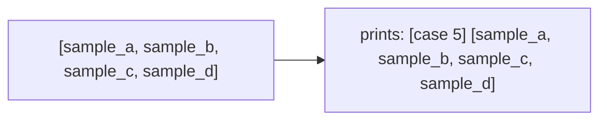
```mermaid
flowchart LR
    B5["[sample_a, sample_b, sample_c, sample_d]"] --> V1["prints: [case 5] [sample_a, sample_b, sample_c, sample_d]"]
```

</details>

### view_cases/case6.nf

**To Do:** 

1. Read the code for `view_cases/case6.nf` and determine how many elements
will be in `ch_c` after `combine()` is applied to `ch_a` and `ch_b`.

2. Enter in your predictions into `ANSWERS.md`

3. Add in a line to use `.count()` and `.view()` and compare the answer you
get to the diagrams you see below, which are a visual representation of what 
the cardinality of each of these processes look like.


**Part 1 -- building two channels**

<details>
<summary>Show diagram</summary>

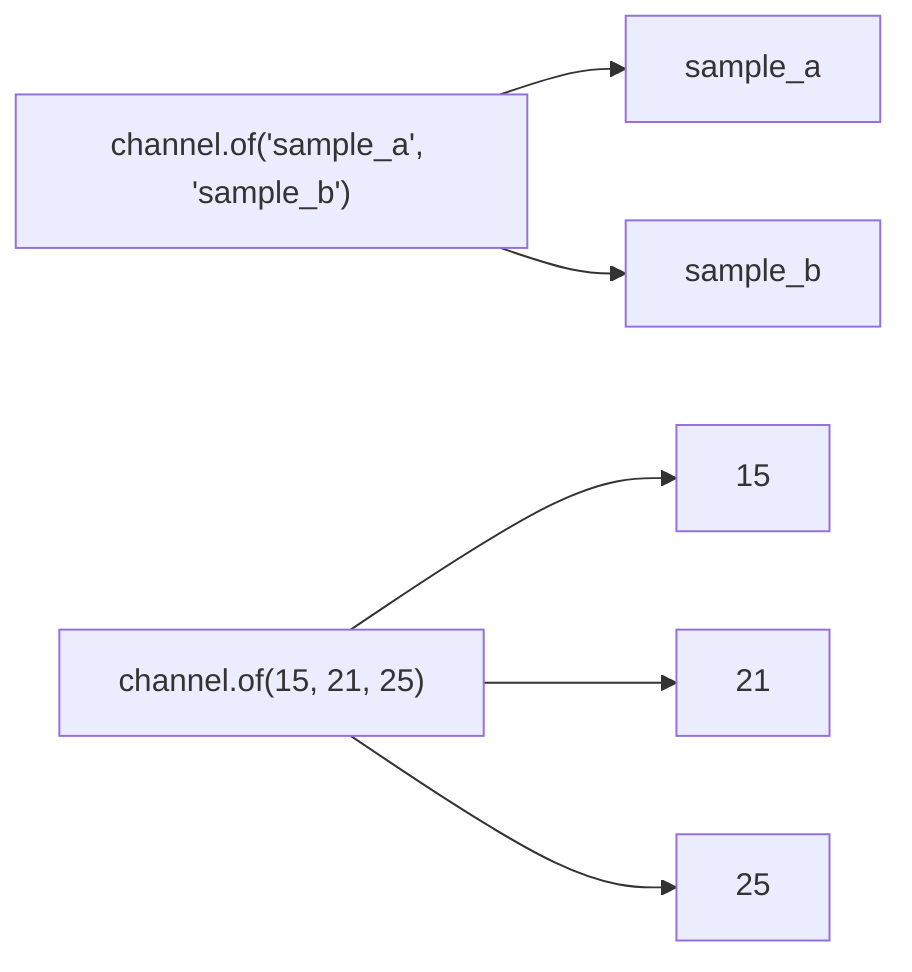
```mermaid
flowchart LR
    A["channel.of('sample_a', 'sample_b')"] --> A1["sample_a"]
    A --> A2["sample_b"]
    B["channel.of(15, 21, 25)"] --> B1["15"]
    B --> B2["21"]
    B --> B3["25"]
```

</details>

**Part 2 -- `.combine()` cross product to ch_c**

<details>
<summary>Show diagram</summary>

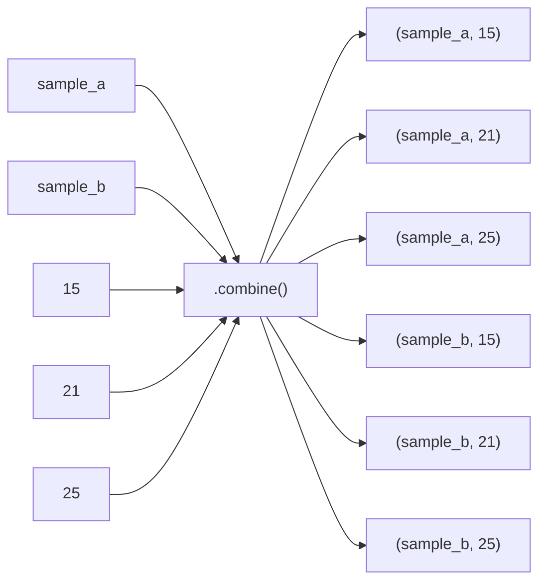
```mermaid
flowchart LR
    A1["sample_a"] & A2["sample_b"] --> X[".combine()"]
    B1["15"] & B2["21"] & B3["25"] --> X
    X --> P1["(sample_a, 15)"]
    X --> P2["(sample_a, 21)"]
    X --> P3["(sample_a, 25)"]
    X --> P4["(sample_b, 15)"]
    X --> P5["(sample_b, 21)"]
    X --> P6["(sample_b, 25)"]
```

</details>

**Part 3 -- `.view()`**

<details>
<summary>Show diagram</summary>

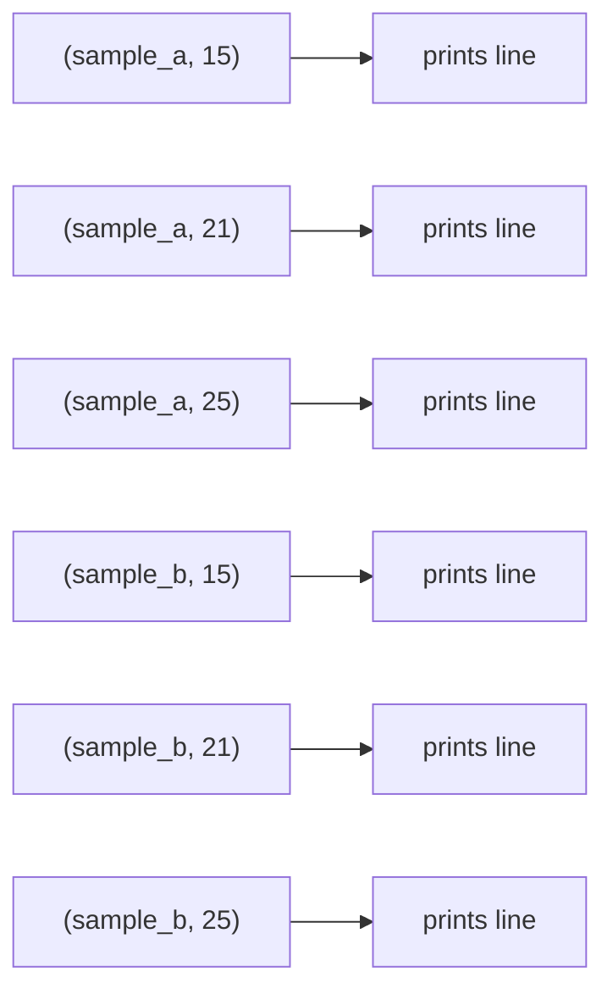
```mermaid
flowchart LR
    P1["(sample_a, 15)"] --> V1["prints line"]
    P2["(sample_a, 21)"] --> V2["prints line"]
    P3["(sample_a, 25)"] --> V3["prints line"]
    P4["(sample_b, 15)"] --> V4["prints line"]
    P5["(sample_b, 21)"] --> V5["prints line"]
    P6["(sample_b, 25)"] --> V6["prints line"]
```

</details>

### view_cases/case7.nf

**To Do:** 

1. Read the code for `view_cases/case7.nf` and determine how many elements
will be in `ch_b` after `flatMap()` is applied.

2. Enter in your predictions into `ANSWERS.md`

3. Add in a line to use `.count()` and `.view()` and compare the answer you
get to the diagrams you see below, which are a visual representation of what 
the cardinality of each of these processes look like.


**Part 1 -- building the channel (3 records, one with an empty rep list)**

<details>
<summary>Show diagram</summary>

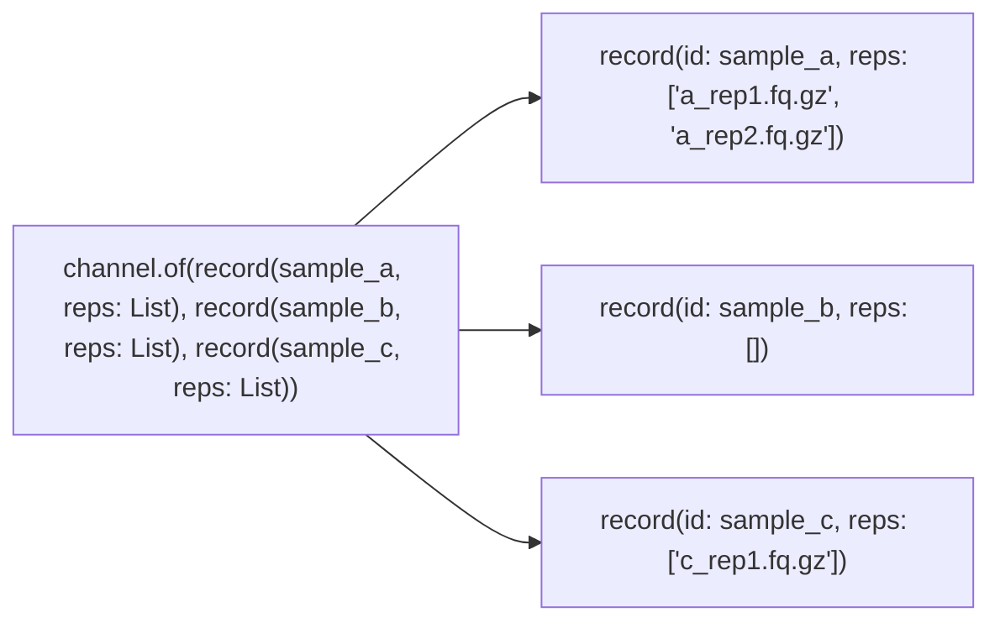
```mermaid
flowchart LR
    A["channel.of(record(sample_a, reps: List), record(sample_b, reps: List), record(sample_c, reps: List))"] --> B1["record(id: sample_a, reps: ['a_rep1.fq.gz', 'a_rep2.fq.gz'])"]
    A --> B2["record(id: sample_b, reps: [])"]
    A --> B3["record(id: sample_c, reps: ['c_rep1.fq.gz'])"]
```

</details>

**Part 2 -- `.flatMap()` unpacking reps to ch_b**

<details>
<summary>Show diagram</summary>

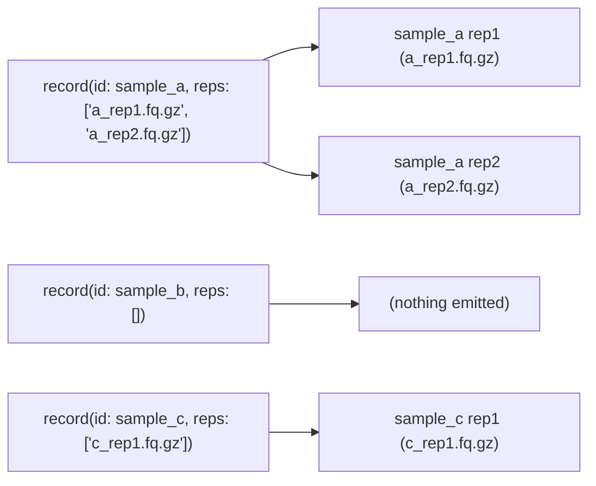
```mermaid
flowchart LR
    B1["record(id: sample_a, reps: ['a_rep1.fq.gz', 'a_rep2.fq.gz'])"] --> F1["sample_a rep1 (a_rep1.fq.gz)"]
    B1 --> F2["sample_a rep2 (a_rep2.fq.gz)"]
    B2["record(id: sample_b, reps: [])"] --> F3["(nothing emitted)"]
    B3["record(id: sample_c, reps: ['c_rep1.fq.gz'])"] --> F4["sample_c rep1 (c_rep1.fq.gz)"]
```

</details>

**Part 3 -- `.view()`**

<details>
<summary>Show diagram</summary>

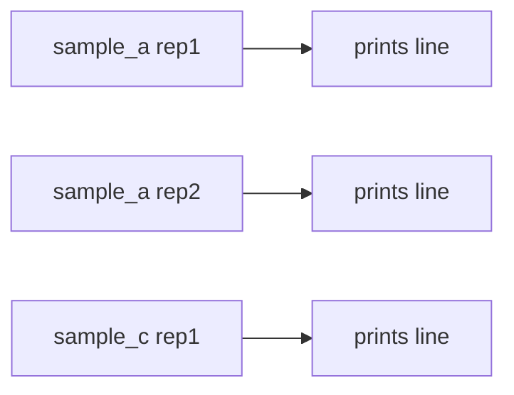
```mermaid
flowchart LR
    F1["sample_a rep1"] --> V1["prints line"]
    F2["sample_a rep2"] --> V2["prints line"]
    F4["sample_c rep1"] --> V3["prints line"]
```

</details>

### view_cases/case8.nf

**To Do:** 

1. Read the code for `view_cases/case8.nf` and determine how many elements
will be in `ch_c` after `flatMap()` and `map()` are applied in succession.

2. Enter in your predictions into `ANSWERS.md`

3. Add in a line to use `.count()` and `.view()` and compare the answer you
get to the diagrams you see below, which are a visual representation of what 
the cardinality of each of these processes look like.


**Part 1 -- building the channel (3 records, each carrying a list of reps)**

<details>
<summary>Show diagram</summary>

```mermaid
flowchart LR
    A["channel.of(record(sample_a, reps: List), record(sample_b, reps: List), record(sample_c, reps: List))"] --> B1["record(id: sample_a, reps: ['sample_a_rep1.fq.gz', 'sample_a_rep2.fq.gz'])"]
    A --> B2["record(id: sample_b, reps: ['sample_b_rep1.fq.gz'])"]
    A --> B3["record(id: sample_c, reps: ['sample_c_rep1.fq.gz', 'sample_c_rep2.fq.gz', 'sample_c_rep3.fq.gz'])"]
```

</details>

**Part 2 -- `.flatMap()` unpacking reps to ch_b (cardinality changes: 3 -> 6)**

<details>
<summary>Show diagram</summary>

```mermaid
flowchart LR
    B1["record(id: sample_a, reps: ['sample_a_rep1.fq.gz', 'sample_a_rep2.fq.gz'])"] --> F1["sample_a_rep1.fq.gz"]
    B1 --> F2["sample_a_rep2.fq.gz"]
    B2["record(id: sample_b, reps: ['sample_b_rep1.fq.gz'])"] --> F3["sample_b_rep1.fq.gz"]
    B3["record(id: sample_c, reps: ['sample_c_rep1.fq.gz', 'sample_c_rep2.fq.gz', 'sample_c_rep3.fq.gz'])"] --> F4["sample_c_rep1.fq.gz"]
    B3 --> F5["sample_c_rep2.fq.gz"]
    B3 --> F6["sample_c_rep3.fq.gz"]
```

</details>

**Part 3 -- `.map()` to ch_c (tags each file with is_gzipped, still 1:1 -- count stays 6)**

<details>
<summary>Show diagram</summary>

```mermaid
flowchart LR
    F1["sample_a_rep1.fq.gz"] --> M1["record(id: sample_a, fastq: sample_a_rep1.fq.gz, is_gzipped: true)"]
    F2["sample_a_rep2.fq.gz"] --> M2["record(id: sample_a, fastq: sample_a_rep2.fq.gz, is_gzipped: true)"]
    F3["sample_b_rep1.fq.gz"] --> M3["record(id: sample_b, fastq: sample_b_rep1.fq.gz, is_gzipped: true)"]
    F4["sample_c_rep1.fq.gz"] --> M4["record(id: sample_c, fastq: sample_c_rep1.fq.gz, is_gzipped: true)"]
    F5["sample_c_rep2.fq.gz"] --> M5["record(id: sample_c, fastq: sample_c_rep2.fq.gz, is_gzipped: true)"]
    F6["sample_c_rep3.fq.gz"] --> M6["record(id: sample_c, fastq: sample_c_rep3.fq.gz, is_gzipped: true)"]
```

</details>

**Part 4 -- `.view()`**

<details>
<summary>Show diagram</summary>

```mermaid
flowchart LR
    M1["record(sample_a, rep1, ...)"] --> V1["prints line"]
    M2["record(sample_a, rep2, ...)"] --> V2["prints line"]
    M3["record(sample_b, rep1, ...)"] --> V3["prints line"]
    M4["record(sample_c, rep1, ...)"] --> V4["prints line"]
    M5["record(sample_c, rep2, ...)"] --> V5["prints line"]
    M6["record(sample_c, rep3, ...)"] --> V6["prints line"]
```

</details>

Now that you've traced each case, fill in your predictions and results in
[`ANSWERS.md`](ANSWERS.md), if you haven't been updating it as you went.

## Part 2: Apply operators to transform channels in real bioinformatics situations

In this next part, you'll apply what you know about cardinality and operators to
build the channels a real workflow needs. Each exercise models a task you'd actually
run into in a bioinformatics pipeline and requires you to reshape, unpack, gather
or regroup data using the right operator for the job. 

Go to the respectively named directory based on the header (map() code lives in
map/)

Each part will have you `cd` into the directory named. When finished, please ensure you
return to the top-level of the directory and `cd` into the next one. 

### map()

**Formal Definition**
`map` applies a mapping function to each item from a source channel. That
mapping function is usually supplied as a closure.

**Bioinformatics Pipeline Framing**
In this case, the functions that parse a CSV return a `LinkedHashMap`. This
object behaves similarly to a record, but it is **not** a record, and all of
our Nextflow pipelines expect a record. We will use `map()` to transform each
hashmap to a record with the same fields. Notice how the cardinality does not
change.

<details>
<summary>Show diagram</summary>

```mermaid
flowchart LR
    A["samplesheet.csv (fromPath + splitCsv)"] --> R1["[sample: ctl_1, fq: ...]"]
    A --> R2["[sample: ctl_2, fq: ...]"]
    A --> R3["[sample: trt_1, fq: ...]"]
    A --> R4["[sample: trt_2, fq: ...]"]
    R1 --> M1[".map()"] --> C1["record(name: ctl_1, fastq: ctl_1.fastq.gz)"]
    R2 --> M2[".map()"] --> C2["record(name: ctl_2, fastq: ctl_2.fastq.gz)"]
    R3 --> M3[".map()"] --> C3["record(name: trt_1, fastq: trt_1.fastq.gz)"]
    R4 --> M4[".map()"] --> C4["record(name: trt_2, fastq: trt_2.fastq.gz)"]
    C1 & C2 & C3 & C4 --> F["FASTQC (4 separate tasks)"]
```

</details>

**Your Turn**
Navigate to the `map/` directory and look around -- check the directory
structure (`modules/`, `samples/`, `samplesheet.csv`) and read through
`main.nf` and `modules/fastqc/main.nf` to see what the workflow is doing
before you touch anything. Then try to complete the `main.nf` and apply `map`
to properly transform the initial channel so that the workflow completes 
successfully. Feel free to use the `.view()` operator to help you determine if
your use of the operator is creating the appropriate channel.

When you are confident with your `map/main.nf`, please use the following commands:

```nextflow
cd map/
nextflow run main.nf -profile local,conda 
```

### flatMap()

**Formal Definition**
`flatMap` applies a mapping function to each item from a source channel. When
that function returns a list, each element of the list is emitted as its own
separate item, rather than as one list -- cardinality can grow from the
mapping.

**Bioinformatics Pipeline Framing**
Similar to `map()`, except here each sample has two FASTQ files (R1/R2) and we
want FastQC to run independently on each one, in parallel. If we instead
passed both FASTQs into a single `FASTQC` call, that process would run once
per sample handling both files serially, instead of twice per sample in
parallel. We use `flatMap()` to unpack each sample's list of FASTQs into
separate emissions.

<details>
<summary>Show diagram</summary>

```mermaid
flowchart LR
    A["samplesheet.csv (fromPath + splitCsv + map to record)"] --> S1["record(name: ctl_rep1, r1: ctl_rep1_R1.fastq.gz, r2: ctl_rep1_R2.fastq.gz)"]
    A --> S2["record(name: trt_rep1, r1: trt_rep1_R1.fastq.gz, r2: trt_rep1_R2.fastq.gz)"]
    S1 --> F1[".flatMap()"] --> C1["record(ctl_rep1, ctl_rep1_R1.fastq.gz)"]
    F1 --> C2["record(ctl_rep1, ctl_rep1_R2.fastq.gz)"]
    S2 --> F2[".flatMap()"] --> C3["record(trt_rep1, trt_rep1_R1.fastq.gz)"]
    F2 --> C4["record(trt_rep1, trt_rep1_R2.fastq.gz)"]
    C1 & C2 & C3 & C4 --> FQC["FASTQC (4 separate tasks, one per file)"]
```

</details>

**Your Turn**
Navigate to the `flatMap/` directory and look around -- check the directory
structure (`modules/`, `samples/`, `samplesheet.csv`) and read through
`main.nf` and `modules/fastqc/main.nf` to see what the workflow is doing
before you touch anything. Then try to complete the `main.nf` and apply
`flatMap` to properly transform the initial channel so that the workflow
completes successfully. Feel free to use the `.view()` operator to help you
determine if your use of the operator is creating the appropriate channel.

When you are confident with your `main.nf`, please use the following command:

```nextflow
cd flatMap/
nextflow run main.nf -profile local,conda
```

### combine()

**Formal Definition**
`combine` pairs every item from one channel with every item from another,
emitting the full cross product. If the source channels emit N and M items
respectively, `combine` emits N x M items -- cardinality multiplies, rather
than staying 1:1 like `map` or collapsing to one like `collect`.

**Bioinformatics Pipeline Framing**
Here we're estimating the optimal k-mer size for genome assembly. Each
assembly needs to be counted at several candidate k values, and we don't know
in advance which k will give the cleanest spectrum. `combine()` builds every
(assembly, k) pairing up front -- 2 assemblies x 4 k-values -- so `KMER_COUNT`
can run once per pairing and the resulting spectra can be compared afterward.

This would also be useful for when you are unsure of the appropriate value for
some parameter and wish to try a range of them to observe their results. 

<details>
<summary>Show diagram</summary>

```mermaid
flowchart LR
    A["assemblies_ch: staph_aureus, pseudomonas_aeruginosa"] --> X[".combine()"]
    B["k_values_ch: 15, 21, 25, 31"] --> X
    X --> P1["(staph_aureus, 15)"]
    X --> P2["(staph_aureus, 21)"]
    X --> P3["(staph_aureus, 25)"]
    X --> P4["(staph_aureus, 31)"]
    X --> P5["(pseudomonas_aeruginosa, 15)"]
    X --> P6["(pseudomonas_aeruginosa, 21)"]
    X --> P7["(pseudomonas_aeruginosa, 25)"]
    X --> P8["(pseudomonas_aeruginosa, 31)"]
    P1 & P2 & P3 & P4 & P5 & P6 & P7 & P8 --> K["KMER_COUNT (8 separate tasks)"]
```

</details>

**Your Turn**
Navigate to the `combine/` directory and look around -- check the directory
structure (`modules/`, `samplesheet.csv`) and read through `main.nf` to see
what the workflow is doing. `combine()` is already wired up to build the
cross product of assemblies and k-values. Use the `.view()` and `.count()`
calls already in place to confirm the emission count matches what you'd
expect from N assemblies x M k-values before the process runs.

When you are confident with your `main.nf`, please use the following command:

```nextflow
cd combine/
nextflow run main.nf
```

Please note that the process it's passed to is fake, it simply prints out the values
passed to it. Kmer counting is somewhat computationally intensive so this script doesn't
actually run it so that you can see the answer quickly. 

### collect()

**Formal Definition**
`collect` gathers every item emitted by a channel into a single list and
emits that list as one value. Cardinality goes from N down to 1 -- the
opposite direction of `flatMap`.

**Bioinformatics Pipeline Framing**
In this case, several per-sample files need to be combined into a single
matrix before they're useful -- e.g. concatenating per-sample count files
into one table for downstream analysis. If `CONCAT` ran once per file, each
invocation would only ever see one file at a time. `collect()` ensures every
file is gathered into a single list first, so `CONCAT` runs exactly once, with
every file as one input.

For this example, we have generated the count of reads falling into exons (mRNAseq)
for 4 different samples (2 control and 2 experimental). In order to do a differential
expression analysis, we need to concatenate all of the counts for each gene for each 
sample into the same file. 

If you look at the `*.exon.txt` files, you'll notice that these files have two columns,
gene and count, and all of the rows are the same (representing every gene in the GTF file
used for quantification). 

Look at the output created, `concat_df.csv`, and you should be able to see how all 4 files
were needed to generate this output.

<details>
<summary>Show diagram</summary>

```mermaid
flowchart LR
    A["samples/*"] --> F1["control_rep1.exon.txt"]
    A --> F2["control_rep2.exon.txt"]
    A --> F3["exp_rep1.exon.txt"]
    A --> F4["exp_rep2.exon.txt"]
    F1 & F2 & F3 & F4 --> L[".collect()"] --> B["[control_rep1..., control_rep2..., exp_rep1..., exp_rep2...]"]
    B --> C["CONCAT (1 task, all files)"]
```

</details>

**Your Turn**
Navigate to the `collect/` directory and look around -- check the directory
structure (`modules/`, `samples/`) and read through `main.nf` and
`modules/concat/main.nf` to see what the workflow is doing before you touch
anything. Then try to complete the `main.nf` and apply `collect` to properly
transform the initial channel so that `CONCAT` runs only once, on all of the
files, rather than once per file. Feel free to use the `.view()` operator to
help you determine if your use of the operator is creating the appropriate
channel.

When you are confident with your `main.nf`, please use the following command:

```nextflow
cd collect/
nextflow run main.nf -profile local,conda
```

### join()

**Formal Definition**
`join` matches items from two channels by a shared key (by default, the
first element of each emitted tuple) and emits one combined item per match.
Unlike `combine`, which crosses every item with every item, `join` pairs up
items that share a key -- if both channels emit N items with matching keys,
`join` emits N items, not N x M. Order doesn't matter: `join` matches on the
key itself, not on emission position. When joining records, you should
specify the value of the record to join using `by: "value-of-record-to-join-on"`

**Bioinformatics Pipeline Framing**
Here, each sample was sequenced from a different bacterial strain, so reads
and reference genomes live in two separate channels keyed by sample id, and
each sample's reads must be aligned against *its own* matching reference --
not every reference. `join()` pairs each sample's reads with the correct
reference by id before alignment, so `ALIGN` runs once per sample with the
right reads/reference combination, even though the two source channels don't
emit their samples in the same order.

<details>
<summary>Show diagram</summary>

```mermaid
flowchart LR
    RA["reads_ch: (sample_a, reads_a)"] --> J[".join()"]
    RB["reads_ch: (sample_b, reads_b)"] --> J
    RC["reads_ch: (sample_c, reads_c)"] --> J
    GB["reference_ch: (sample_b, ref_b)"] --> J
    GA["reference_ch: (sample_a, ref_a)"] --> J
    GC["reference_ch: (sample_c, ref_c)"] --> J
    J --> M1["(sample_a, reads_a, ref_a)"]
    J --> M2["(sample_b, reads_b, ref_b)"]
    J --> M3["(sample_c, reads_c, ref_c)"]
    M1 & M2 & M3 --> AL["ALIGN (3 tasks, not 9)"]
```

</details>

**Your Turn**
Navigate to the `join/` directory and look around -- there are no modules
here, so read through `main.nf` on its own to see what the workflow is doing
before you touch anything. Then try to complete the `main.nf` and apply
`join` to properly pair each sample's reads with its matching reference so
that `ALIGN` runs once per sample. Feel free to use the `.view()` and
`.count()` operators to confirm you get N emissions back, not N x M.

When you are confident with your `main.nf`, please use the following command:

```nextflow
cd join/
nextflow run main.nf
```

### A note on syntax: typed inputs and string interpolation

A couple of the process modules (e.g. `collect/modules/concat/main.nf`) use syntax
that's easy to misread if you haven't seen it before:

**`List<Path>` typed inputs** -- with `nextflow.enable.types = true`, a process can
declare its inputs and outputs with explicit types instead of the usual `val`/`path`
qualifiers (`all_files: List<Path>` instead of `input: path(all_files)`). It's still
just an input parameter -- `all_files` here is a Groovy `List` of `Path` objects, one
per file the upstream channel collected.

**`${x.join(' ')}` in script blocks** -- `all_files` is a list of `Path` objects, and
`.join(' ')` turns that list into a single space-separated string of file paths
(e.g. `/data/a.txt /data/b.txt /data/c.txt`), so all of them can be passed to
`concat_df.py -i ...` as one argument. That join has to happen inside `${...}`: a
process's `script:` block is a Groovy string, and bare `$` interpolation only expands
a variable or plain property chain (`$name`, `$record.id`) -- it does **not** include
method calls. Write `"$all_files.join(' ')"` and it interpolates `all_files` by
itself (its raw `toString()`, brackets and all) then appends the literal text
`.join(' ')`, completely unevaluated. Wrapping it as `"${all_files.join(' ')}"` runs
the join first and inserts the resulting space-separated string -- this is a common
silent bug, since it doesn't error, it just quietly produces a malformed command.